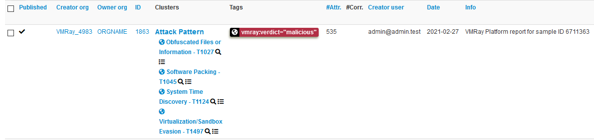

# vmray-misp-feed

Automatically import VMRay Platform analyses into MISP as a feed.



## Getting Started

There are two ways to get started:

1. Using the [install script](./install.sh), which automates most of the process.
2. Manually installing vmray-misp-feed; see [Installation](./docs/install.md) for instructions applicable to most use cases

If you choose to use the install script, please inspect the script before execution.
To install, run:

```bash
curl https://raw.githubusercontent.com/vmray/vmray-misp-feed/main/install.sh | sh
```

When done, the install script prints out instructions for running and starting **vmray-misp-feed**.

You can also find the instructions for setting up a MISP feed in the [docs](./docs/misp-feeds.md).

For a more detailed description on how to configure **vmray-misp-feed**, see [vmray-misp-feed](./docs/vmray-misp-feed.md)

### Using Docker

You can also run and host the MISP feed using Docker. Therefor you'll first need to create a configuration:

```
cp config.toml.template config.toml
```

After that you can use the `compose.yml` and `docker compose up -d` to start and server the feed.
You can use the `crontab` file to change the frequency of the execution.
Make sure that the feed path from the config matches the compose file volume mappings.