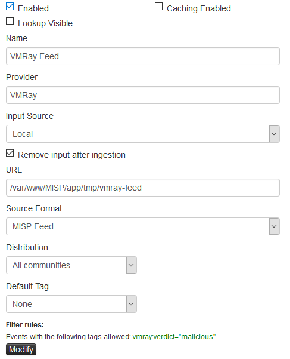

# MISP Feed

MISP provides a function called feed that enables you to fetch MISP events from a server. It can be used to fetch the **vmray-feed**.

## Create a New Local Feed

To import events created by the **vmray-feed**, create a new feed, as follows:

Go to `Sync Action -> List Feeds` and click on `Add Feed` on the left hand side and fill in the form:

* **Enable**: True
* **Name**: VMRay-Feed
* **Provider**: VMRay
* **Input Source**: Local
* **Remove input after ingestion**: True
* **URL**: /var/www/MISP/app/tmp/vmray-misp-feed (if you changed `feed_path` in `config.toml`, point the path to the new location instead)
* **Source Format**: MISP Feed

If you prefer to only import samples that have a verdict of Malicious, click on `Modify` under `Filter rules` and add `vmray:verdict="malicious"` to the allowed tags. You also need to set `use_vmray_tags = true` in the `config.toml` in the **vmray-misp-feed** folder.

